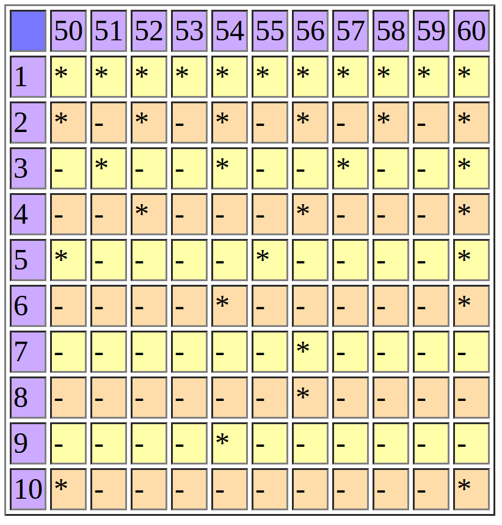

<h1>Estructuras de control</h1>
<h2>Ejercicio 1</h2>

Crea un array con notas aleatorias de una asignatura. Si la media de las notas da aprobado, muestra por pantalla un mensaje de felicitacion. En caso contrario muestra un mensaje con la media que ha sacado.

<h2>Ejercicio 2</h2>

Crea un array con notas aleatorias de una asignatura. Recorre el array para mostrar todas las notas por pantalla.

<h2>Ejercicio 3</h2>

Crea una variable entera aleatoria llamada “edad” y muestrala por pantalla. Si la edad es mayor de 65 años, muestra por pantalla el mensaje “Ya puedes disfrutar de la jubilacion”. Si la edad esta entre 18 y 65 (incluidos) muestra por pantalla “Estas en edad laboral”. Si la edad es menor de 18 muestra “Todavia no puedes trabajar”.

<h2>Ejercicio 4</h2>

Crea un array con notas aleatorias. Muestra por pantalla solo las notas que estan aprobadas.

<h2>Ejercicio 5</h2>

Imprime por pantalla las tablas de multiplicar del 1 al 10 usando bucles for anidados. Solo puedes usar una vez la instruccion echo.

<h2>Ejercicio 6</h2>

Mostrar por pantalla los numero del 1 al 100, separados por coma.

<h2>Ejercicio 7</h2>

Mostrar por pantalla los numeros del 100 al 0 en orden descendente, dando el salto de 2 en 2. Es decir, 100, 98, 96…2, 0.

<h2>Ejercicio 8</h2>

Mostrar una figura similar a la siguiente. NOTA: solo esta permitido el uso de un * en todo el codigo.

    * 
    **
    ***
    ****
    *****
    ******
<h2>Ejercicio 9</h2>

Mostrar por pantalla todos los divisores de un numero obtenido de forma aleatoria con la funcion rand().

<h2>Ejercicio 10</h2>

Mostrar por pantalla si un numero es o no primo.

<h2>Ejercicio 11</h2>

Mostrar los 20 primeros terminos de la sucesion de Fibonacci. La sucesion de Fibonacci se caracteriza por tener el primer elemento: 1, el segundo elemento:1 y el resto de elementos: se forman sumando los 2 terminos anteriores:

0, 1, 1, 2, 3, 5, 8, 13, 21, 34, 55, 89, 144, 233, 377, 610, 987, 1597, 2584, 4181, 6765, 10946, 17711, 28657, 46368, 75025, 121393, 196418, 317811, 514229, 832040, 1346269, 2178309, 3524578, 5702887, 9227465, 14930352, 24157817, 39088169, 63245986, 102334155...

<h2>Ejercicio 12</h2>

Crear una tabla en PHP. La tabla mostrara lo divisores de los numeros entre 50 y 60 (incluidos), como puede verse en la siguiente figura:

<h2>Ejercicio 13</h2>

En un edificio hay 5 pisos y en cada piso hay 4 puertas. Imprimir usando las menos intrucciones posibles una lista de todas las direcciones del edificio.

<h2>Ejercicio 14</h2>

Hacer un programa en PHP que en funcion del valor de la variable $pais, diga si la nacionalidad de una persona es ingles, aleman, italiano, español, frances u otra.

<h2>Ejercicio 15</h2>

Crea una pagina Web que genere un numero aleatorio entre 1 y 100 e imprima los numeros impares comprendidos entre dicho numero y cero.

